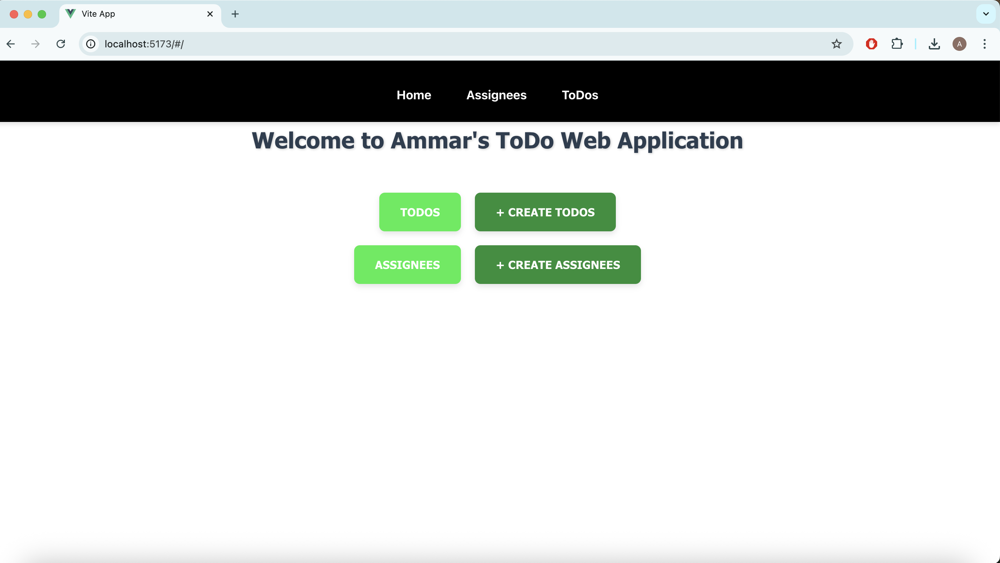
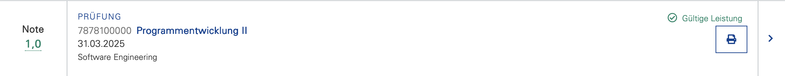

# ToDo Application

## Beschreibung

Diese Applikation ist eine einfache REST-basierte Anwendung zur Verwaltung von ToDos und Assignees. Sie bietet CRUD-Operationen für beide Entitäten und speichert die Daten in einer MariaDB-Datenbank.
(Diese Applikation folgt dem Schema des Beispielprojektes in PE II)

# Preview

## Voraussetzungen

Stellen Sie sicher, dass die folgenden Programme auf Ihrem System installiert sind:

- Java 21 oder höher
- Maven 3.8.0 oder höher
- MariaDB (lokal oder remote)
- Node.js
- npm
- Git

## Konfiguration

1. Klonen Sie das Repository:

git clone https://github.com/Ammar404z/Ammar-s-ToDo-WebApp.git

2. Stellen Sie sicher, dass Ihre MariaDB-Instanz läuft.
   • Achten Sie darauf, dass die MariaDB-Instanz korrekt konfiguriert und erreichbar ist. (username: root, Password: root).

## Ausführung Backend

1. Navigiere zum Repository: (wichtig: zu den api Ordner)

cd repo086/api

2. Installieren Sie die Dependencies mit:

mvn install

3. Bauen und starten Sie die Anwendung mit Maven:

mvn spring-boot:run

4. Die API (Backend) ist nun unter http://localhost:8080/api/v1/ verfügbar.

## Ausführung Frontend

1. Navigiere zum Repository: (wichtig: zu den Frontend Ordner)

cd repo086/frontend

2. Installieren Sie die Dependencies mit:

npm install

3. Bauen und starten Sie die Anwendung mit npm:

npm run dev

4. Das Frontend ist nun unter http://localhost:5173/ verfügbar.

## Features

- **ToDos**: Erstellen, Bearbeiten, Löschen und Filtern von Aufgaben.
- **Assignees**: Verwaltung der Personen, die für Aufgaben verantwortlich sind.
- **Filter und Sortierung**:
  - Filtern von ToDos nach Titel (Substring-Filterung).
  - Sortieren der ToDos nach Titel und Fälligkeitsdatum (aufsteigend/absteigend).
- **Abgeschlossene Aufgaben**: Abgeschlossene ToDos können separat angezeigt werden.
- **Kategoriezuweisung**: Automatische Zuweisung von Kategorien zu ToDos basierend auf ihrem Titel mithilfe eines trainierten Modells (PMML).
- **CSV-Export**: Herunterladen aller ToDos als CSV-Datei mit allen relevanten Attributen.

## Technologien

- **Frontend**: Vue.js 3 mit Composition API
- **Styling**: Agnostic UI, CSS
- **Backend**: RESTful API (Spring Boot)

## Note

Dieses Projekt wurde im Kurs "Programmentwicklung II" (Universität Stuttgart) entwickelt und mit der Note **1,0** bewertet.

